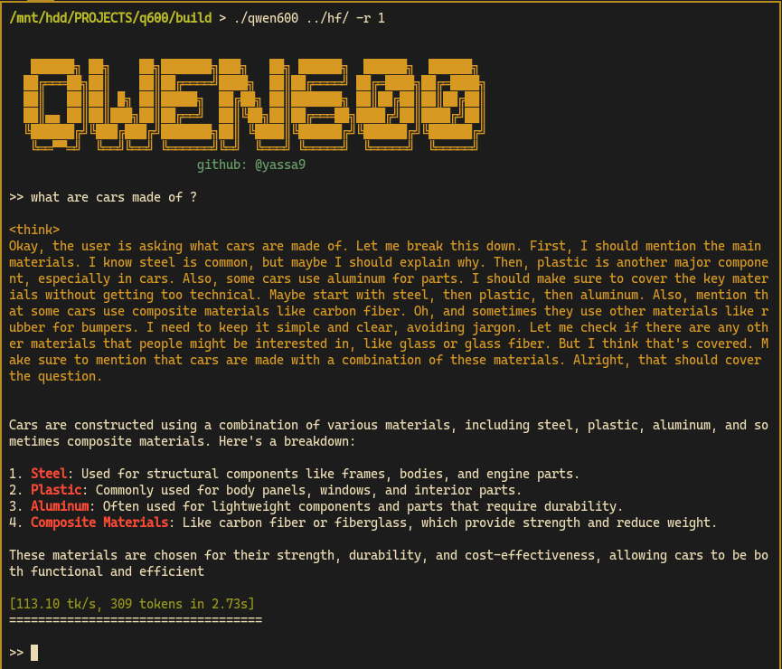

## qwen600.cu

<p align="center">
  
</p>

While studying and practicing  CUDA & GPGPU, thought why not make an inference engine from scratch ? So, chose [QWEN3-0.6B](https://huggingface.co/Qwen/Qwen3-0.6B) model, small model than can run smoothly on my `RTX 3050 8GB` VRAM.
My intention was (and still) to build educational program to learn about LLMs & transformers while maintaining practice in CUDA programming.

I'm introducing static mini inference engine for `QWEN3-0.6B` instruct model in `bf16`, where its benchmarking claims that it's faster than [llama.cpp](https://github.com/ggml-org/llama.cpp) by approximately `8.5%` & `hf with flash-attn` by `292%` in `tokens/sec`, *see benchmarks below*.

---

What does `qwen600` include:
- single batch inference engine
- static-constanted for compile-time optimization
- all CUDA C/C++, no python dependencies (except for tokenizer setup)
- minimal libraries (cuBLAS, CUB, std IO)
- efficient memory pipeline: mmap, single GPU block, async copy
- zero-cost pointer-based weight management on GPU

---

`qwen600` is inspired by:
- [llama.cpp - ggml](https://github.com/ggml-org/llama.cpp)
- [llama2.c - Andrej Karpathy](https://github.com/karpathy/llama2.c)
- [LLMs-from-scratch - Sebastian Raschka](https://github.com/rasbt/LLMs-from-scratch)
- [qwen3.c - Adrian Cable](https://github.com/adriancable/qwen3.c)

---

## WANNA TASTE ?!

### Initial Setup

First, you need to clone [QWEN3-0.6B](https://huggingface.co/Qwen/Qwen3-0.6B).
This is fantastic [hugging face doc blog](https://huggingface.co/docs/hub/en/repositories-getting-started) to start with cloning hf repos.

then as a safe approach, you locate the weights file (model.safetensors) and sha256sum:
```bash
sha256sum <model_dir>/<safetensors-file-name>
```
and output must be according to hf:
```text
f47f71177f32bcd101b7573ec9171e6a57f4f4d31148d38e382306f42996874b
```

After that:

```bash
git clone https://github.com/yassa9/qwen600
cd qwen600
```

Assume that downloaded hugging face dir is `<model_dir>`.

We convert the Hugging Face tokenizer into the format used by `qwen600`.

```bash
python export.py <model_dir>
```

That gonna output some template files and most importantly: `tokenizer.bin`

### Building qwen600

Now we are ready to build !
You just want: 
- `CUDA` + `nvcc`
- `cuBLAS` + `CUB` 

```bash
mkdir build && cd build
cmake .. && make -j$(nproc)
```
Just that simple, no other bulky libraries and dependencies to build.

## Moment of Truth: Running the Model

You can see arguments manual by: 

```bash
# you are now inside qwen600/build
./qwen600
```

the output be that manual:
```aiignore
usage:   ./qwen600 <model_dir> [options]
example: ./qwen600 <model_dir> -r 1
model directory must contain:
  - model.safetensors
  - tokenizer.bin
  - template_*.txt files

arguments:
----------
  -r <int>    reasoning mode, 0 (default) = no thinking, 1 = thinking
  -s <int>    random seed, default
  -k <int>    k value in top-k sampling, default 20
  -t <float>  temperature in [0,inf], default 0.6
  -p <float>  p value in top-p (nucleus) sampling in [0,1], default 0.95
  -i <string> input prompt
  -y <string> system prompt in chat mode, default is none
```

For example:

```bash
./qwen600 <model_dir> -r 1 -t 0.65 -p 0.9 -k 20
```

or simply going with defaults:

```bash
./qwen600 <model_dir> -r 1
```

Based on official hugging face [model card](https://huggingface.co/Qwen/Qwen3-0.6B), they advise that:

```txt
- For thinking mode (enable_thinking=True), use Temperature=0.6, TopP=0.95, TopK=20. 
- DO NOT use greedy decoding, as it can lead to performance degradation and endless repetitions.
- For non-thinking mode (enable_thinking=False), we suggest using Temperature=0.7, TopP=0.8, TopK=20, and MinP=0.
```

## Some Experiments

### Without THINKING

```bash
./qwen600 <model_dir> -r 0

>> what is capital of Greece ?
```

> The capital of Greece is **Athens**

> [231.71 tk/s, 19 tokens in 0.08s]

```bash
>> tell me interesting fact about whales ?
```

> One of the most fascinating facts about whales is that they are the only mammals that can swim upside down. This ability allows them to navigate through the ocean in a unique way, using their tails as a natural propeller

> [632.31 tk/s, 227 tokens in 0.36s]

### With the REASONING MODE, aka THINKING

<p align="center">
  
</p>

```bash
./qwen600 <model_dir> -r 1

>> what are llms used for ?
```

> Okay, the user is asking what LLMs (Large Language Models) are used for. Let me start by recalling what I know about them. LLMs are a type of AI model that can understand and generate human language. They're used in various fields because they can process a lot of text and perform tasks like answering questions, generating content, and even creating stories.

> First, I should mention their primary applications. Like, in customer service, where they can help with queries. Then, maybe some examples like writing articles, generating code, or even creating content. Also, I should think about how they're used in different industries. For instance, healthcare, finance, education, etc.

> Wait, are there any specific industries where LLMs are particularly used? Maybe in customer service for chatbots, or in creative fields like art or music. Also, in research, maybe for data analysis or information retrieval. I need to make sure the answer is comprehensive but not too technical. Let me structure it step by step: definition, applications, industries, examples, and maybe a brief mention of limitations or challenges.

> I should also check if there's any recent advancements in LLMs that I should include. For example, the development of more powerful models that can handle more complex tasks. But maybe that's beyond the current scope. The user might be looking for a clear and concise answer. Let me make sure to cover key areas without getting too detailed.

now the responding:
> Large Language Models (LLMs) are advanced AI systems designed to understand and generate human language. They are used in a variety of applications across different industries to improve efficiency, accuracy, and accessibility of information. Here are some key uses:

> 1. Customer Service and Chatbots: LLMs help in answering questions, resolving customer issues, and providing real-time assistance. For example, chatbots can handle inquiries, resolve complaints, and even provide product recommendations.

> 2. Writing and Content Creation: They can generate articles, creative content, and even code. For instance, they might assist in writing research papers, creating marketing content, or generating creative scripts.

> 3. Data Analysis and Research: LLMs analyze large datasets, extract insights, and help with information retrieval. They are useful in fields like finance, healthcare, and education for tasks like summarizing data, identifying patterns, and generating reports.

> 4. Creative Industries: In areas like art, music, and design, LLMs can generate original content, music, and visual art, assisting artists and producers.

> 5. Education: They support personalized learning, provide explanations, and assist in language learning by generating interactive content.

> 6. Healthcare: LLMs can help diagnose medical conditions, explain treatments, and support patient education.

> Limitations: While LLMs are powerful, they may face challenges in handling complex tasks, understanding context, or adapting to new information. However, ongoing advancements in training and model architecture continue to expand their capabilities

> [111.44 tk/s, 604 tokens in 5.42s]

## Benchmarking

These benchmarks are done on same machine:
- RTX 3050 8BG + CUDA 13.0
- AMD ryzen 5 3500
- 16GB RAM
- Void Linux

Every Number here is mean of consecutive 5 runs of same parameters where `temp = 0` to be greedy, done manually (no scripts).

Every test is with the same question `what are llms used for ?` in `THINKING` mode.

| inference engine | ~ tokens/sec 
| ---              | ---      
| hf + flash-attn  | 29.57 
| llama.cpp        | 107.19
| qwen600          | **116.15**

`NOTE`: As I mentioned earlier, it is EDUCATIONAL project for me, I'm not aiming for winning a race, but I think that difference caused by static compile-time optimizations, and some other tweaks and tricks.

## TODOs

There are still many catches there:
- [x] Fusing RMSnorm Kernel
- [x] Fusing skip connections with cuBLAS
- [ ] Fix Softmax Kernel & Dispatcher
- [ ] Exploring option of RoPE pre-computed values

## License

MIT